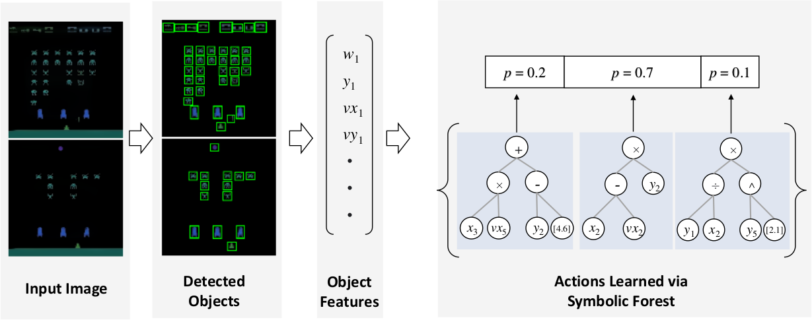
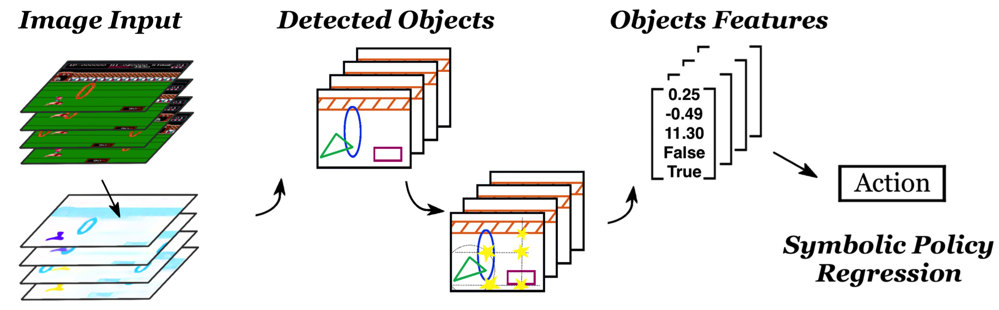
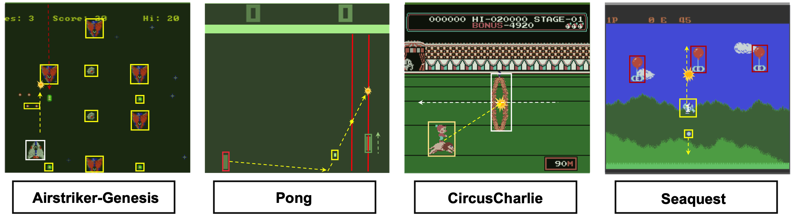
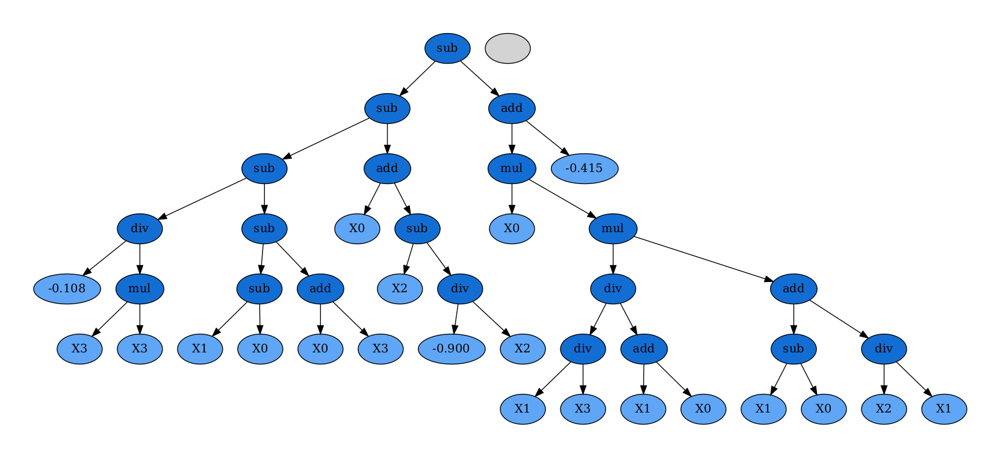

<div align="center">

# Symbolic Visual Reinforcement Learning: A Scalable Framework with Object-Level Abstraction and Differentiable Expression Search

**[Wenqing Zheng](http://wenqing-zheng.github.io)\*, [S P Sharan](https://github.com/Syzygianinfern0)\*, [Zhiwen Fan](https://zhiwenfan.github.io), [Kevin Wang](), [Yihan Xi](), [Atlas Wang](https://www.ece.utexas.edu/people/faculty/atlas-wang)**

<!-- **Accepted at [NeurIPS 2022](https://neurips.cc/virtual/2022/poster/54408)** -->

| [```Website```](https://vita-group.github.io/DiffSES) | [```Arxiv```](https://arxiv.org/abs/2212.14849) |
:------------------------------------------------------:|:-----------------------------------------------:|



</div>

---

# Introduction

Learning efficient and interpretable policies has been a challenging task in reinforcement learning (RL), particularly
in the visual RL setting with complex scenes. While deep neural networks have achieved competitive performance, the
resulting policies are often over-parameterized black boxes that are difficult to interpret and deploy efficiently. More
recent symbolic RL frameworks have shown that high-level domain-specific programming logic can be designed to handle
both policy learning and symbolic planning. However, these approaches often rely on human-coded primitives with little
feature learning, and when applied to high-dimensional continuous conversations such as visual scenes, they can suffer
from scalability issues and perform poorly when images have complicated compositions and object interactions.
To address these challenges, we propose Differentiable Symbolic Expression Search (DiffSES), a novel symbolic learning
approach that discovers discrete symbolic policies using partially differentiable optimization. By using object-level
abstractions instead of raw pixel-level inputs, DiffSES is able to leverage the simplicity and scalability advantages of
symbolic expressions, while also incorporating the strengths of neural networks for feature learning and optimization.
Our experiments demonstrate that DiffSES is able to generate symbolic policies that are more interpretable and scalable
than state-of-the-art symbolic RL methods, even with a reduced amount of symbolic prior knowledge.

<div align="center">
<table>
<tr>
<td>

</td>
</tr>
<tr>
<th>
Inference procedure of the learned symbolic policy
</th>
</tr>
</table>
</div>

# Results

<div align="center">
<table>
<tr>
<td>

</td>
</tr>
<tr>
<th>
A subset of our trained environments
</th>
</tr>
</table>
</div>

Here is the comparison of the models in a transfer learning setting. In this setting, the teacher DRL model is trained
in AdventureIsland3, and the symbolic agent is learned based on it. Then both agents are applied to AdventureIsland2
without fine-tuning. The performance of the symbolic policy drops less than DRL model.

<div align="center">
<table>
<tr>
<td>
<video src="https://user-images.githubusercontent.com/31875325/209475899-301e7ace-cc24-4ad9-8aa5-c83950d5d1e8.mp4">
</video>
</td>
</tr>
<tr>
<th>
Symbolic policies enable ease of transfer owing to the disentanglement of control policies and feature extraction steps.
</th>
</tr>
</table>
</div>

<div align="center">
<table>
<tr>
<td>

</td>
</tr>
<tr>
<th>
Visualization of a trained DiffSES policy
</th>
</tr>
</table>
</div>

---

# Usage

## Stage I - Neural Policy Learning

> Training a Visual RL agent as a teacher

- Stable baselines 3 for PPO training

Run `train_visual_rl.py` with appropriate environment selected. Refer to stable baselines zoo for additional
configuration options. Use the wrappers provided in `retro_utils.py` for running on retro environments with multiple
lives and stages.

Trained model will be generated in the `logs/` folder (along with tensorboard logs).

## Stage II - Symbolic Fitting

> Distillation of Teacher agent into Symbolic Student

- GPLearn on offline dataset of teacher's actions

### Part A: Training a self-supervised object detector

Training images for multiple atari environments can be
found [here](https://drive.google.com/file/d/1vzFVFhJZDZMkJ8liROtIyzOiUY42r4TZ/view). If you would like to run on
custom/other environments, consider generating them using the provided script `save_frames.py`. We then proceed to train
the OD module using these frames.

For more training parameters, consider referring the scripts and the SPACE project's documentation.

```shell
cd space/
python main.py --task train --config configs/atari_spaceinvaders.yaml resume True device 'cuda:0'
```

This should generate weights in the `space/output/logs` folder. Pretrained models from SPACE are
available [here](https://drive.google.com/file/d/1gUvLTfy5pKeLa6k3RT8GiEXWiGG8XzzD/view).

### Part B: Generating the offline dataset

Save teacher model's behavior (state-action pairs) along with OD module processing all such states. This creates a JSON
of the form. `sample.json` contains a dummy dataset for demonstration purposes.

```
[
  {
    "state": [
      {
        "type": int,
        "x_velocity": float,
        "y_velocity": float,
        "x_position": int,
        "y_position": int
      },
      {
        "type": int,
        "x_velocity": float,
        ...
      }
      ...
    ],
    "teacher_action": int
  }
  ...
]
```

### Part C: Symbolic distillation

We use gplearn's symbolic regression API in `distill_teacher.py` to train a symbolic tree to mimic the teacher's
actions. The operators are as defined in the file and can easily be extended for more operands through the simple
gplearn APIs. Please check `see/judges.py` for a few sample implementations of operators. The operands are the states
from JSON as stored. We recommend running this experiment numerous times to achieve good performance as convergence of
such a random search is not a guarantee every time. Please refer to `gplearn_optuna.py` for a sample of automating such
a search on random data.

## Stage III - Fine-tuning Symbolic Tree

> Neural Guided Differentiable Search

Lastly, our symbolic finetuning stage consists of `symbolic_finetuning.py` which uses a custom implementation of gplearn
modified in order to support the following:

- **RL style training:** rewards as a fitness metric rather than MSE with respect to teacher behavior.
- **Differentiable constant optimization:** new mutation scheme where the constants are set to be differentiable, the
  tree acts as the policy network for a PPO agent and optimization is performed on those constants.
- **Soft expert supervision in loss:** add-on to earlier bullet along with an extra loss term to aforementioned loss
  being
  the difference between the teacher's action and the symbolic tree's prediction.

While running that file, please run a `pip install -e .` inside the custom implementation of gplearn to install the
local version instead of the prebuilt wheels from PyPi. Similar to [Part 2.3](#part-c--symbolic-distillation), we
recommend running this experiment numerous times to achieve
acceptable levels of convergence.

## Citation

If you find our code implementation helpful for your own research or work, please cite our paper.

```bibtex
@article{zheng2022symbolic,
  title={Symbolic Visual Reinforcement Learning: A Scalable Framework with Object-Level Abstraction and Differentiable Expression Search},
  author={Zheng, Wenqing and Sharan, SP and Fan, Zhiwen and Wang, Kevin and Xi, Yihan and Wang, Zhangyang},
  journal={arXiv preprint arXiv:2212.14849},
  year={2022}
}
```

# Contact

For any queries, please [raise an issue](https://github.com/VITA-Group/DiffSES/issues/new) or
contact [Wenqing Zheng](mailto:w.zheng@utexas.edu).

# License

This project is open sourced under [MIT License](LICENSE).
